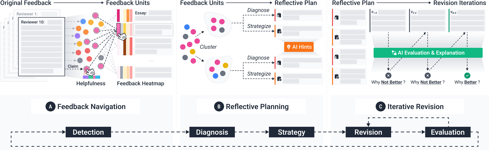

# Friction: Deciphering Writing Feedback into Writing Revisions through LLM-Assisted Reflection

[**Link to CHI 2025 Paper**](https://doi.org/10.1145/3706598.3714316)

This paper introduces Friction, a novel interface designed to scaffold novice writers in reflective feedback-driven revisions. Effective revision requires mindful reflection upon feedback, but the scale and variability of feedback can make it challenging for novice writers to decipher it into actionable, meaningful changes. Friction leverages large language models to break down large feedback collections into manageable units, visualizes their distribution across sentences and issues through a co-located heatmap, and guides users through structured reflection and revision with adaptive hints and real-time evaluation. Our user study (N=16) showed that Friction helped users allocate more time to reflective planning, attend to more critical issues, develop more actionable and satisfactory revision plans, iterate more frequently, and ultimately produce higher-quality revisions, compared to the baseline system. These findings highlight the potential of human-AI collaboration to foster a balanced approach between maximum efficiency and deliberate reflection, supporting the development of writing mastery.



## Setup
First, run the development server:

```bash
npm run dev
# or
yarn dev
# or
pnpm dev
```

Open [http://localhost:3000](http://localhost:3000) with your browser to see the result.

## CHI 2024 Paper

**Friction: Deciphering Writing Feedback into Writing Revisions through LLM-Assisted Reflection**<br />
Chao Zhang, Kexin Ju, Peter Bidoshi, Yu-Chun Grace Yen, Jeffrey M. Rzeszotarski


**Please cite this paper if you used the code or prompts in this repository.**

> Chao Zhang, Kexin Ju, Peter Bidoshi, Yu-Chun Grace Yen, and Jeffrey M. Rzeszotarski. 2025. Friction: Deciphering Writing Feedback into Writing Revisions through LLM-Assisted Reflection. In CHI Conference on Human Factors in Computing Systems (CHI '25), April 26-May 1, 2025, Yokohama, Japan. ACM, New York, NY, USA, 28 pages. https://doi.org/10.1145/3706598.3714316

```bibtex
@inproceedings{10.1145/3706598.3714316,
  author = {Zhang, Chao and Ju, Kexin and Bidoshi, Peter and Yen, Yu-Chun Grace and Rzeszotarski, Jeffrey M.},
  title = {Friction: Deciphering Writing Feedback into Writing Revisions through LLM-Assisted Reflection},
  year = {2025},
  isbn = {9798400713941},
  publisher = {Association for Computing Machinery},
  address = {New York, NY, USA},
  url = {https://doi-org.proxy.library.cornell.edu/10.1145/3706598.3714316},
  doi = {10.1145/3706598.3714316},
  abstract = {This paper introduces Friction, a novel interface designed to scaffold novice writers in reflective feedback-driven revisions. Effective revision requires mindful reflection upon feedback, but the scale and variability of feedback can make it challenging for novice writers to decipher it into actionable, meaningful changes. Friction leverages large language models to break down large feedback collections into manageable units, visualizes their distribution across sentences and issues through a co-located heatmap, and guides users through structured reflection and revision with adaptive hints and real-time evaluation. Our user study (N = 16) showed that Friction helped users allocate more time to reflective planning, attend to more critical issues, develop more actionable and satisfactory revision plans, iterate more frequently, and ultimately produce higher-quality revisions, compared to the baseline system. These findings highlight the potential of human-AI collaboration to foster a balanced approach between maximum efficiency and deliberate reflection, supporting the development of creative mastery.},
  booktitle = {Proceedings of the 2025 CHI Conference on Human Factors in Computing Systems},
  articleno = {935},
  numpages = {27},
  keywords = {Feedback, Reflection, Sensemaking, Writing, Revision, Creativity, Large Language Models},
  location = {Yokohama, Japan},
  series = {CHI '25}
}
```

## Acknowledgements

We sincerely thank our participants for sharing their thoughts and feedback on our system, as well as the reviewers for their valuable insights and suggestions.
